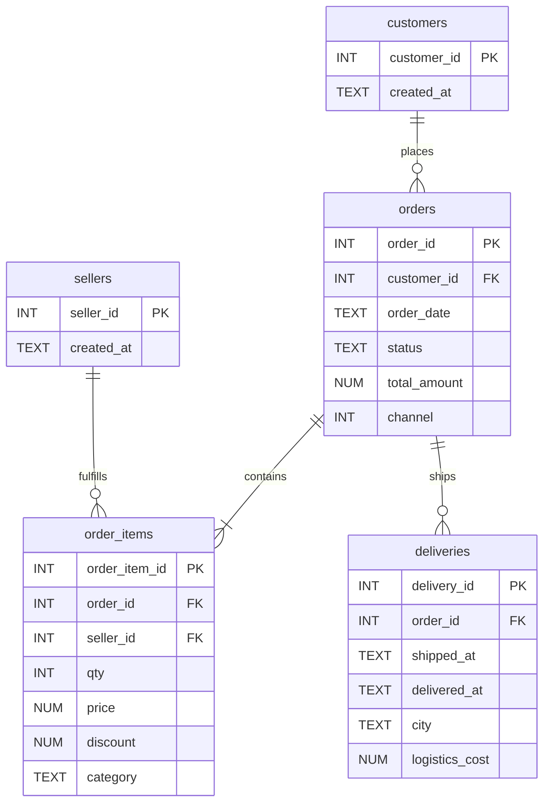

# SQL E‑commerce Analytics Warehouse

**Timeline:** Dec’24 (project window) · **Stack:** SQL (SQLite/Postgres), Excel, Python (optional)  
**Scope:** Centralize orders/customers/sellers data; design schemas + indexes; write analytic SQL for customer LTV,
churn/retention, funnel analysis, seller ranking, and logistics efficiency. Provide small sample data and
runnable queries.

## Quick start (SQLite)
```bash
# 1) Create DB
sqlite3 ecommerce.db < schema.sql

# 2) Load sample CSVs (requires sqlite3 CLI >= 3.32 with .import)
.mode csv
.import sample_data/customers.csv customers
.import sample_data/sellers.csv sellers
.import sample_data/orders.csv orders
.import sample_data/order_items.csv order_items
.import sample_data/deliveries.csv deliveries

# 3) Run example analyses
.read queries/ltv.sql
.read queries/churn.sql
.read queries/funnel.sql
.read queries/seller_efficiency.sql
```

> For Postgres, run `schema.sql` (it is ANSI‑SQL). Use `\copy` to load CSVs.

## Data model (ERD)


## Included analyses
- **LTV**: rolling 12‑month revenue per customer with cohort start, ARPU, and CLV proxy.
- **Churn**: inactivity beyond 90 days (configurable); cohort retention table.
- **Funnel**: `view → add_to_cart → checkout → paid` conversion by week/channel.
- **Seller efficiency**: GMV, cancellation rate, fill rate, on‑time delivery %, and unit economics.

## Notes
- Sample data are tiny (for illustration). Replace with your warehouse tables or scale up.
- All queries avoid window‑function exotica to stay SQLite/Postgres compatible.
- Indexes included for typical analytics workloads.
```

